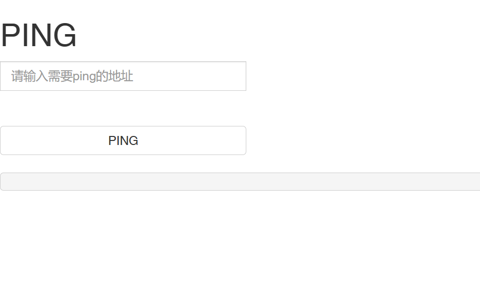
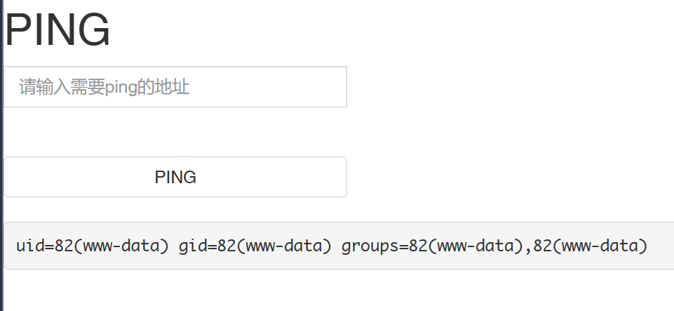

# Code execution

## [ACTF2020 新生赛]Exec 1

这是一道命令注入的题目，进来发现只有一个ping地址的输入框。看起来应该是被用来拼在ping命令后面，如：`ping localhost`。如果没有检查的话，可以用分号隔开在ping命令后执行更多命令，如：`ping localhost;id`，试了一下确实可以：

但是不清楚的是flag应该通过什么命令来获得。经外部提示知道flag应该是在文件里面，所以可以用`ls`命令寻找一下，在根目录下发现有名为flag的文件，查看可获得flag。

因此答案：`;cat /flag`
